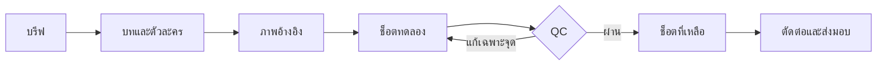

<div align="center">


# สร้างหนังสั้นจีน ให้เป็นเรื่องของคุณ

**จากไอเดียหรือแหล่งข้อมูล → บท → ตัวละคร/หลักฐาน → ช็อตวิดีโอ → งานพร้อมตรวจ**

คู่มือและพรอมป์ต์ภาษาไทยสำหรับ **ChatGPT · Claude · Google Flow**

[](https://github.com/boombignose/chinese-short-film-flow/actions/workflows/check.yml)
[](LICENSE)
[](docs/CHATGPT.md)
[](examples/quick-demo.md)

**[เริ่มใช้](#quick-start) · [ลองหนึ่งช็อต](examples/quick-demo.md) · [ตัวอย่าง 6 ช็อต](examples/jade-seal-48s.md) · [ผลทดสอบ](docs/TEST-REPORT.md)**

[ดาวน์โหลดชุดไฟล์ ZIP](https://github.com/boombignose/chinese-short-film-flow/archive/refs/heads/main.zip) · [ดูคลิปต้นทาง](https://youtu.be/7ZbYX93n4GY)

</div>

---

> **เริ่มได้โดยไม่เขียนโค้ด** — ใช้ชุดพรอมป์ต์นี้วางแผนใน ChatGPT หรือ Claude แล้วนำไปสร้างสื่อใน Google Flow การเจนวิดีโอต้องมีบัญชีและเครดิตตามบริการที่ใช้ เวอร์ชัน v3 รองรับ Fiction และ Documentary พร้อม duration plan, credit log, Lean Scope, Content Plan และ Evidence Gate

## ในชุดนี้มีอะไร

| 🎬 เขียนเรื่อง | 🎭 ล็อกตัวละคร | 🎥 สร้างทีละช็อต | 🎧 ตรวจงาน |
|---|---|---|---|
| Hook · ความขัดแย้ง · หักมุม | ใบหน้า · ชุด · เสียง · reference | Storyboard · กล้อง · บทพูด | เสียงตรงคน · ภาพต่อเนื่อง · ซับ |

เหมาะกับครีเอเตอร์ที่อยากทดลองหนังจีนแนวตั้ง ครูที่ต้องการตัวอย่างสอน และคนทำงานที่อยากใช้บรีฟเดียวกันข้าม ChatGPT/Claude

งานเรื่องจริงหรือสารคดีให้เปิด [กติกา Source ledger และภาพจำลอง](docs/DOCUMENTARY.md) ก่อนเขียนบท ใช้ [Workflow V3](docs/WORKFLOW-V3.md) เมื่อต้องการควบคุมขอบเขต วาง Hook/Caption และบังคับตรวจหลักฐานก่อนรายงานว่าเสร็จ ส่วนประวัติการปรับดูได้ใน [CHANGELOG](CHANGELOG.md)

<a id="quick-start"></a>

## เริ่มใช้ใน 3 ขั้นตอน

### 1 · เปิด Project แล้วแนบไฟล์

ดาวน์โหลด ZIP และแตกไฟล์ สร้าง Project ของหนังเรื่องนี้ใน **ChatGPT** หรือ **Claude** วาง [MASTER-PROMPT.md](prompts/MASTER-PROMPT.md) เป็นคำสั่งโปรเจกต์ แล้วแนบ:

- [WORKFLOW.md](WORKFLOW.md) — ลำดับผลิตและเกณฑ์ตรวจ
- [PRODUCTION.md](templates/PRODUCTION.md) — แบบกรอกบรีฟและบันทึกช็อต
- [jade-seal-48s.md](examples/jade-seal-48s.md) — ตัวอย่างบทและพรอมป์ต์ครบตอน

ไม่มี Projects ก็ใช้แชตใหม่แล้ววางคำสั่งและบรีฟเป็นข้อความได้

### 2 · ส่งบรีฟนี้ แล้วเลือกเรื่อง

```text
ใช้เวิร์กโฟลว์ในไฟล์ที่แนบ โหมด Fiction ช่วยสร้างหนังจีนย้อนยุคแนวตั้ง 9:16
เป้าหมาย 48 วินาที 6 ช็อต ตัวละครหลักผู้ใหญ่ 2 คน พูดภาษาไทย
แนวลึกลับโรแมนติก เปิดเรื่องให้น่าติดตามและหักมุมท้ายตอน
เสนอเรื่อง 3 แบบ แล้วพัฒนาแบบที่ฉันเลือก
ส่งบรีฟ character bible บท storyboard และพรอมป์ต์ Google Flow แยกช็อต
ตอนนี้ทำเอกสารและพรอมป์ต์ก่อน ยังไม่สร้างสื่อหรือเผยแพร่
```

ตัวอย่าง 48 วินาทีเป็นจุดเริ่มต้น ไม่ใช่รูปแบบบังคับ หากต้องการ 30, 45 หรือ 60 วินาที ให้ระบุความยาวตัดต่อเป้าหมาย แล้วตรวจค่าระยะเวลาที่โมเดลรองรับใน UI ก่อนคำนวณจำนวนช็อต

### 3 · ทดลองช็อตเดียวใน Flow

เปิด [ตัวอย่าง 8 วินาที](examples/quick-demo.md) คัดลอกพรอมป์ต์ไปที่ [Google Flow](https://labs.google/fx/tools/flow) ตั้ง 9:16 และหนึ่งผลลัพธ์ ตรวจโมเดลและเครดิตก่อนสร้าง แล้วเปิดวิดีโอเทียบกับ checklist เมื่อผ่านจึงทำช็อตที่เหลือ

**คู่มือเฉพาะเครื่องมือ:** [ChatGPT](docs/CHATGPT.md) · [Claude](docs/CLAUDE.md) · [Google Flow](docs/GOOGLE-FLOW.md) · [Agent ที่มี browser tools](prompts/OPERATOR.md)

---

## ลองจากตัวอย่าง

### 🏮 ตราหยกใต้โคมแดง

<p align="center">
  <a href="assets/demo.mp4"></a>
</p>

<p align="center"><strong>ทดลองจริงด้วย Google Flow · 8 วินาที · 720 × 1280</strong><br>
GIF ไม่มีเสียง · <a href="assets/demo.mp4">เปิดไฟล์ MP4 พร้อมเสียง</a> · <a href="docs/TEST-REPORT.md">อ่านผล QC</a></p>

> ตัวอย่างนี้เป็น **take ทดลอง** มีข้อสังเกตเรื่องรูปทรงตราหยกและเสียงที่ต้องตรวจต่อ ไม่ใช่งาน final ที่ผ่าน QC ทุกข้อ

> “แต่ชื่อคนตาย คือชื่อของท่าน”
>
> หญิงสาวนำตราหยกเข้ามาในหอเอกสาร แต่คนที่ขวางทางเธอ กลับมีชื่อเดียวกับผู้ตายที่เธอกำลังตามหา

| ตัวอย่าง | สิ่งที่ได้ | เปิดดู |
|---|---|---|
| **หนึ่งช็อต · 8 วินาที** | พรอมป์ต์พร้อมวาง ผู้พูดหนึ่งคน และ checklist | [ลองเลย →](examples/quick-demo.md) |
| **หนึ่งตอน · 48 วินาที** | Character bible, storyboard, บทไทย, พรอมป์ต์ภาพ และวิดีโอ 6 ช็อต | [อ่านชุดเต็ม →](examples/jade-seal-48s.md) |
| **แก้ช็อตที่ไม่ผ่าน** | คำสั่งแก้เสียงผิดคน หน้าเปลี่ยน และงานเจน error | [เปิดชุดแก้ไข →](prompts/REPAIR.md) |

ภาพปกเป็นภาพแนวคิดที่สร้างใหม่ด้วย imagegen ไม่ใช่เฟรมวิดีโอจาก Google Flow สถานะของการทดสอบแต่ละส่วนระบุไว้ใน [รายงานทดสอบ](docs/TEST-REPORT.md)

<details>
<summary><strong>อีก 3 ไอเดียสำหรับเปลี่ยนบรีฟ</strong></summary>

| แนว | Hook ที่ลองใช้ได้ | สิ่งที่ต้องล็อก |
|---|---|---|
| โรแมนติกย้อนยุค | คนที่นางต้องแต่งงานด้วย คือผู้พิพากษาคดีของบิดา | ชุดพิธี แหวน และสถานะความสัมพันธ์ |
| CEO จีนร่วมสมัย | พนักงานใหม่รู้รหัสตู้เซฟที่เจ้าของบริษัทเพิ่งเปลี่ยน | อายุผู้ใหญ่ เสื้อผ้า ออฟฟิศ และอุปกรณ์ |
| สืบสวนในวัง | โคมหนึ่งดวงถูกจุดทุกคืน ทั้งที่ตำหนักถูกปิดตาย | ตำแหน่งโคม เวลา แสง และจำนวนตัวละคร |

เป็นไอเดียตั้งต้นที่แต่งใหม่ ให้ AI พัฒนาเป็นบรีฟและบทก่อนสร้างสื่อ

</details>

## เวิร์กโฟลว์ที่ใช้



อ่านรายละเอียดและเกณฑ์ผ่านทุกขั้นใน [WORKFLOW.md](WORKFLOW.md)

## ทดสอบและตรวจคุณภาพ

ตรวจเอกสารและตัวอย่างด้วย Python 3.9+ โดยไม่ติดตั้งแพ็กเกจ:

```sh
git clone https://github.com/boombignose/chinese-short-film-flow.git
cd chinese-short-film-flow
python3 scripts/check_repo.py
```

ชุดตรวจเช็กไฟล์อ้างอิงใน Markdown/HTML, code fences, ภาพปก PNG, storyboard 6 ช็อตต่อเนื่อง 48 วินาที บท/ผู้พูดที่ตรงกับพรอมป์ต์ และ marker สำคัญของ v3 พร้อม unit tests สำหรับ timeline บทพูด ผู้พูด และหลักฐานก่อนปิดงาน GitHub Actions รันชุดตรวจเดียวกันเมื่อมี push หรือ pull request

**การตรวจเอกสารไม่ได้ยืนยันคุณภาพวิดีโอ** — ผลทดสอบจริงและส่วนที่ยังต้องให้คนตรวจอยู่ใน [TEST-REPORT.md](docs/TEST-REPORT.md)

<details>
<summary><strong>แผนผังไฟล์ทั้งหมด</strong></summary>

```text
chinese-short-film-flow/
├── README.md                 ← เริ่มที่นี่
├── CHANGELOG.md              ← ประวัติการปรับ v2
├── WORKFLOW.md               ← ขั้นตอนผลิต
├── AGENTS.md / CLAUDE.md      ← คำสั่งสำหรับ local agent
├── assets/hero.png           ← ภาพปกที่สร้างใหม่
├── prompts/                  ← ผู้กำกับ / operator / แก้ช็อต
├── templates/PRODUCTION.md   ← บรีฟและ production log
├── examples/                 ← ตัวอย่าง 8 วินาทีและ 6 ช็อต
├── docs/                     ← คู่มือ รวมโหมด Documentary และผลทดสอบ
├── scripts/check_repo.py     ← ชุดตรวจที่รันซ้ำได้
├── tests/                    ← unit tests ของตัวตรวจ
└── .agents/skills/           ← Skill แบบเลือกใช้
```

[บทวิเคราะห์คลิป](docs/VIDEO-ANALYSIS.md) · [แนวทางจัดหน้า](docs/DESIGN-NOTES.md) · [Skill](.agents/skills/chinese-short-film/SKILL.md)

</details>

## คำถามที่เจอบ่อย

<details>
<summary><strong>ใช้ ChatGPT หรือ Claude ตัวไหนก็ได้ไหม?</strong></summary>

ใช้ช่วยเขียนบทและพรอมป์ต์ได้เมื่ออ่านไฟล์หรือข้อความที่ให้ได้ ความสามารถสร้างภาพและควบคุมเบราว์เซอร์ขึ้นกับบัญชีและเครื่องมือ ไม่ได้เพิ่มขึ้นเองจากการวาง prompt

</details>

<details>
<summary><strong>repo นี้สร้างหนังและโพสต์ให้อัตโนมัติหรือเปล่า?</strong></summary>

เป็นชุดเอกสารและพรอมป์ต์ ไม่มีบริการ API หรือระบบอัตโนมัติที่ติดตั้งมาให้ หากใช้ agent ที่มี browser tools จริง ให้ใช้ [OPERATOR.md](prompts/OPERATOR.md) ภายในขอบเขตที่อนุญาต และตรวจไฟล์ก่อนเผยแพร่

</details>

<details>
<summary><strong>ทำไมต้องทดลองทีละช็อตและตรวจเสียง?</strong></summary>

คลิปต้นทางแสดงทั้งการเจนล้มเหลวและเสียงผู้พูดที่หลุดบท จึงต้องเก็บช็อตที่ผ่าน แก้เฉพาะจุด และตรวจภาพ/เสียงจริง ดู [บทวิเคราะห์พร้อมเวลา](docs/VIDEO-ANALYSIS.md)

</details>

---

**ต้นทางและเครดิต** · ถอดบทเรียนจาก [BoomBigNose — ChatGPT × Google Flow](https://youtu.be/7ZbYX93n4GY) ส่วน Claude และเรื่องตัวอย่างเป็นงานต่อยอดของ repo นี้ แนวจัดข้อมูลศึกษา [prompts.chat](https://github.com/f/prompts.chat), [Superpowers](https://github.com/obra/superpowers) และ [Anthropic Skills](https://github.com/anthropics/skills)

เนื้อหาและตัวอย่างที่เขียนใหม่ใช้ [MIT License](LICENSE) สื่อและชื่อผลิตภัณฑ์ของบุคคลอื่นเป็นของเจ้าของเดิม ไม่แจกไฟล์คลิปต้นฉบับ ตรวจคู่มือผลิตภัณฑ์วันที่ 21 กันยายน 2026; รุ่นโมเดล เมนู และราคาเครดิตอาจเปลี่ยนได้
